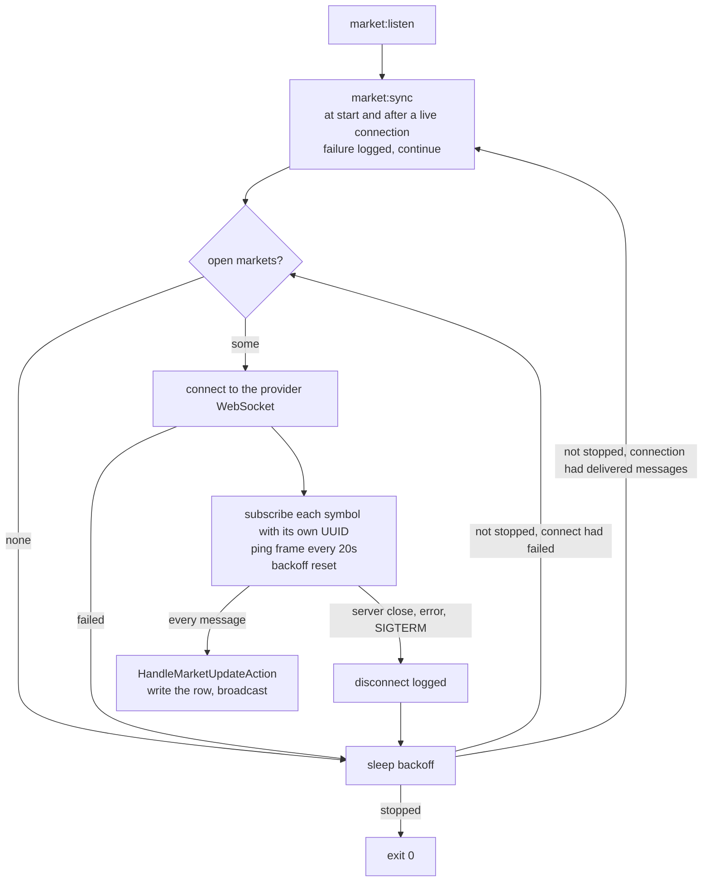

# Market listener

What `php artisan market:listen` does, what each provider message does to the `markets` table, and how the process fails and recovers, beyond what `ListenToMarketsCommand`, `HandleMarketUpdateAction`, `Backoff` and `MarketUpdated` show. Reasoning lives in [design decisions](../specs/design-decisions.md) 16 to 20; provider facts in [figure-markets-api.md](figure-markets-api.md); the sync it runs in [market-sync.md](market-sync.md).

## Lifecycle

`composer run dev` starts it as the `listener` process next to Reverb. One process holds one connection to the provider and subscribes to every open market, so the browser never talks to the provider and the listener runs whether or not anyone is looking at the dashboard.

## One message

| Case | Effect | Console | Log |
|------|--------|---------|-----|
| `publishTime` after the row's `price_updated_at`, or the row has none | Live columns and `price_updated_at` written, then `MarketUpdated` broadcast | `HASH-USD 0.020000000000000000 at 10:37:55.734` | |
| `publishTime` not after `price_updated_at` (stale) | Nothing | `Skipped a message, see the log for details.` | warning with both timestamps |
| `marketId` not in the table | Nothing | same | warning with the symbol |
| No `marketId` or `publishTime`, including the provider's `Invalid request` reply | Nothing | same | warning with the raw message |
| Not a JSON object at all | Nothing | same | warning with the raw text |
| Broadcast to Reverb fails | Row stays written, connection stays up | update line as usual | exception reported |

The row is written before the event is dispatched, and the event is dispatched by the action, not by a model event, so the REST sync never broadcasts. Every accepted message writes and broadcasts even when only the timestamp changed ([decision 16](../specs/design-decisions.md)).

## Broadcast

`MarketUpdated` is `ShouldBroadcastNow` on `PrivateChannel('markets')` as `market.updated`, payload the market's array including `id`. Reverb's client timeouts are 2 seconds (`broadcasting.connections.reverb.client_options`) so a slow Reverb cannot starve the ping timer. Channel authorization is added with the dashboard component.

## Keeping the connection alive

The provider applies two rules to every WebSocket connection, both verified against UAT:

| Rule | What the listener does |
|------|------------------------|
| A connection that sends nothing for 30 seconds is closed | Sends a WebSocket **ping frame** every 20 seconds. A ping frame is a small control message defined by the WebSocket protocol (opcode 9), separate from the text messages that carry data; the server answers with a pong frame. The provider rejects text messages such as `PING`, so the frame is the only option. Most UAT markets are quiet for minutes, so without the ping the connection would die soon after subscribing. |
| Every connection is closed after 30 minutes, whatever happens | Nothing special. The close is treated like any other disconnect and the loop reconnects, see below. |

## Reconnecting

Any end of a connection takes the same path: the server closing it (the 30-minute cap or anything else), a failed connect, or an exception inside the loop. The listener logs what happened, waits, and starts the loop again. After a connection that delivered messages the loop runs the sync first, so each routine reconnect refreshes the market list; failed connect attempts skip the sync so a WebSocket outage never turns into a REST call every few seconds. Every connection resubscribes to every open market with fresh channel UUIDs.

The wait between attempts comes from `Backoff`:

| Attempt | Base delay |
|---------|------------|
| 1 | 1s |
| 2 | 2s |
| 3 | 4s |
| 4 | 8s |
| 5 | 16s |
| 6 and later | 30s |

Each delay is randomized by up to ±20%, so the second attempt waits somewhere between 1.6s and 2.4s. The doubling keeps the listener from hammering a provider that is down; the cap keeps the recovery under a minute once the provider is back; the randomization (jitter) stops several listener processes that lost their connection at the same moment from reconnecting in lockstep. The sequence restarts at 1s once the connection delivers its first message, not at the handshake, so a provider that accepts the connection and closes it at once still backs off. A healthy 30-minute session followed by the routine server close reconnects after about one second.

## Stopping

SIGTERM or SIGINT (`Ctrl+C` in `composer run dev`) sets a stop flag and closes the connection. The server acknowledges the close, the loop sees the flag and the process exits with code 0. Nothing is written on shutdown; the table already holds the last accepted update.

## Failure behaviour

| Failure | Outcome |
|---------|---------|
| Sync fails | Logged, listener continues with the rows it has |
| No open markets | Logged, sleep the backoff, retry |
| Connect fails, server closes, exception in the loop | Logged, connection closed, sleep the backoff, retry |
| Broadcast to Reverb fails | Reported, row stays written, connection stays up |
| Stale, unknown or malformed message | Logged and skipped, see the message table above |

## Verified by hand

The socket lifecycle has no automated test ([decision 18](../specs/design-decisions.md)). Checked on 2026-10-02 against UAT with Reverb running: sync, 16 subscriptions, 267 updates in 47 seconds, the connection outliving the 30-second idle cap (so the ping frames work), and SIGTERM producing `Disconnected: 1000` and `Listener stopped.` with exit 0.

## Known gaps

- A `MarketFeed` interface in front of Pawl would let the reconnect, resubscribe, backoff and shutdown paths run against a mock in Pest.
- Reconnect is reactive: the process waits for the 30-minute server close instead of reconnecting before it.
- Broadcasting is synchronous inside the loop. With Reverb down, each message waits the 2-second timeout before the next is handled, so a burst of messages can delay the ping past the provider's 30-second limit and force a reconnect for as long as Reverb stays down. Queued broadcasting is the alternative named in the architecture trade-offs.
- All three are listed under later improvements or trade-offs in the [architecture](../specs/architecture.md).
