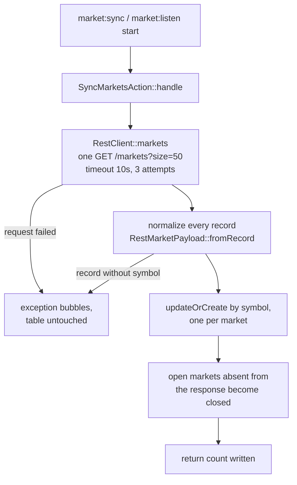

# Market sync

What `php artisan market:sync` does to the `markets` table and how it fails, beyond what `RestClient`, `SyncMarketsAction` and `SyncMarketsCommand` show. Reasoning lives in [design decisions](../specs/design-decisions.md) 12 to 15; provider facts in [figure-markets-api.md](figure-markets-api.md).

## When it runs

On demand through `market:sync`, and once at `market:listen` start so the listener has symbols to subscribe to. There is no scheduled re-sync; a market that changes status between runs keeps its stored status until the next sync.

## Flow

## What a sync writes

| Columns | Effect |
|---------|--------|
| Identity (`symbol` to `price_precision`) | Set from the response. A closed market the provider lists as `OPEN` reopens. |
| Live (`last_price` to `trade_count_24h`) | Overwritten with the REST values, including `0` for an untraded market. |
| `price_updated_at` | Never touched. REST records carry no timestamp; the listener owns this column. |
| `status` of open markets missing from the response | Set to `closed`. Rows are never deleted. |

A response with zero records closes every market, since that is what the provider said ([decision 14](../specs/design-decisions.md)).

## Failure behaviour

Normalization happens for all records before the first write, and the writes run in one transaction, so a failed sync leaves the table exactly as it was.

| Failure | Outcome |
|---------|---------|
| Provider unreachable or 5xx after three attempts | `ConnectionException` or `RequestException` bubbles to the caller |
| 429 | Same as any other error; `Retry-After` is not read ([decision 13](../specs/design-decisions.md)) |
| Record without `symbol` | `MalformedMarketPayload` bubbles |
| Record with `symbol` but missing another required column | `QueryException` bubbles, transaction rolls back |

The action never logs or catches. The command reports the exception, prints `Market sync failed: <message>` and exits 1; on success it prints `Synced <n> markets.` and exits 0. The listener (phase 4) catches the same exceptions and backs off.

## Known gaps

Both are later improvements listed in the [architecture](../specs/architecture.md):

- Pagination is not walked. One request with `size=50` covers the 16 to 17 markets the provider lists; a provider with more than 50 visible markets would be partially synced and the extra markets closed.
- `Retry-After` on 429 is ignored. The three fixed retries are 500 ms apart.
