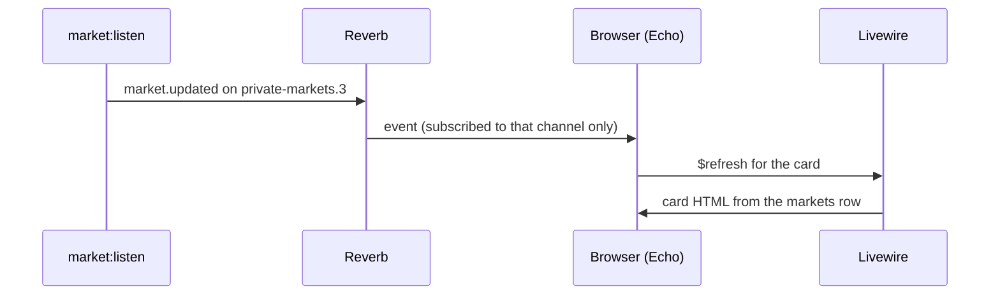

# Market watch

What the dashboard shows, how a price reaches the page without polling, and who may watch, beyond what `MarketWatch`, `MarketStats`, `routes/channels.php` and `DatabaseSeeder` show. Reasoning lives in [design decisions](../specs/design-decisions.md) 21 to 26; the broadcast that feeds it in [market-listen.md](market-listen.md).

## Two components

| Component | Owns | Re-renders when |
|-----------|------|-----------------|
| `MarketWatch` | The market select, the callout when no market is open | The user picks a market |
| `MarketStats` | One market's stats card and the subscription to that market's channel | A `market.updated` event arrives for its market |

The select is bound to `symbol`. Any value that is not an open market, including no value at all on the first render or a closed market, falls back to `HASH-USDC`, the busiest UAT market, or to the first open market by symbol when that one is closed. The card is keyed by the symbol, so a new selection replaces the card with a fresh one and a fresh subscription.

## Push, not poll

The browser subscribes to `private-markets.<id>` for the selected market only, so Reverb sends it nothing about other markets. The channel is keyed by the row id because some symbols contain dots, which a channel parameter never matches. When a card is replaced it leaves its channel, so switching markets does not accumulate subscriptions; Livewire alone would only stop listening while leaving the subscription open. Each event triggers one Livewire request that re-reads the row the listener wrote before broadcasting; the payload itself is not used. There is no timer anywhere: a quiet market produces no requests, a busy one produces one per tick. The alternative, patching the DOM from the payload without a request, is listed under the architecture trade-offs.

## What the card shows

| Stat | Source column | Format |
|------|---------------|--------|
| Last price, 24h change, bid, ask, 24h high, 24h low | the matching live column | `price_precision` decimals, thousands separator |
| 24h change % | `percentage_change_24h` | ratio × 100, two decimals |
| 24h volume | `volume_24h` | up to eight decimals, trailing zeros trimmed |
| 24h trades | `trade_count_24h` | integer with thousands separator |
| Last updated | `price_updated_at` | `Y-m-d H:i:s UTC` |

A null column shows `—`: the provider sent nothing, which on UAT is the case for bid and ask on most markets and for the timestamp until the first tick. The zero an untraded market reports is shown as a zero. The timestamp is absolute because the card only re-renders on its own ticks, so a relative "n seconds ago" would freeze.

## Access

The dashboard sits behind the starter kit's login. Every `markets.{id}` channel is private; the broadcasting auth route rejects guests before the channel callback runs, and the callback admits any logged-in user. `composer run setup` seeds `demo@example.com` with the password `password` for local use; the seeder is idempotent and the account is not meant for a deployment.

## Failure behaviour

| Failure | Outcome |
|---------|---------|
| No open markets in the table | Callout pointing at `composer run dev` (the listener syncs and streams), noting that `market:sync` alone gives a list without live prices; no select |
| Selected market closed by a re-sync | Card keeps the last values until the next page load or selection |
| Browser loses the Reverb connection | Echo reconnects and resubscribes; the card shows the last rendered values meanwhile |
| Reverb unreachable from the listener | Row still written; the next page load or selection is correct (see [market-listen.md](market-listen.md)) |

## Verified by hand

Checked on 2026-10-02 against UAT with `composer run dev`: the `HASH-USDC` card ticks about once a second while the select stays put, a quiet market shows no Livewire requests, and switching markets unsubscribes the old channel and subscribes the new one in the Reverb log.

## Known gaps

- One Livewire request per tick per open browser. Patching the DOM from the payload would remove it, at the cost of browser tests.
- A market that changes status while the page is open is only reflected on the next render of the select.
